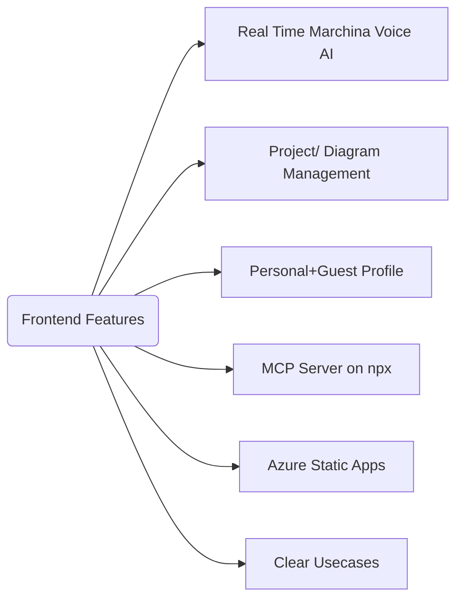

# Marchina Frontend


Marchina Frontend is the frontend for Marchina.

Quick Links to Marchina Repositories
- [Marchina Backend](https://github.com/Paul-M-Kallarackal/marchina-backend)
- [Marchina MCP Server](https://github.com/Paul-M-Kallarackal/marchina-mcp)

### List of Contents
- [Features](#features)
- [Demo & Deployment](#demo--deployment)
- [Prerequisites](#prerequisites)
- [Scripts](#scripts)
- [Project Structure](#project-structure)

## Features



## Demo & Deployment

The frontend is deployed to Azure Static Web Apps:

- **URL:** https://witty-river-0e373710f.6.azurestaticapps.net/

GitHub uses continuous deployment. Commits to `main` trigger workflows that build and deploy the app automatically.

## Prerequisites

- Node.js >= 16.x
- npm >= 7.x
- Azure Static Web Apps CLI (for local testing, optional)


## Scripts

| Script          | Description                             |
|-----------------|-----------------------------------------|
| npm start       | Run the app in development mode (http://localhost:3000)

## Project Structure

```
marchina-frontend/
├── public/               # Static assets and index.html
├── src/                  # Source code
│   ├── components/       # Reusable UI components
│   ├── pages/            # Page-level components (Views)
│   ├── services/         # API service modules
│   ├── contexts/         # React Context providers
│   ├── constants/        # App-wide constants
│   ├── App.js            # Main router and theme provider
│   ├── index.js          # App bootstrap
│   ├── index.css         # Global styles
│   └── App.css           # Custom global CSS
├── .github/              # GitHub Actions workflows
│   └── workflows/
│       ├── main_marchina.yml   # CI workflow
│       └── azure-static-web-apps-*.yml  # Azure deployment
├── tailwind.config.js    # Tailwind CSS configuration
├── postcss.config.js     # PostCSS configuration
├── package.json          # NPM dependencies & scripts
└── README.md             # This file
```

### Key Directories

- **components/**: Navigation, modals, cards, voice input/output
- **pages/**: Dashboard, Projects, Diagram Editor, Use Cases, Voice Assistant
- **services/**: REST & WebSocket service clients (api.js, projectService.js)
- **contexts/**: AuthContext for authentication state

